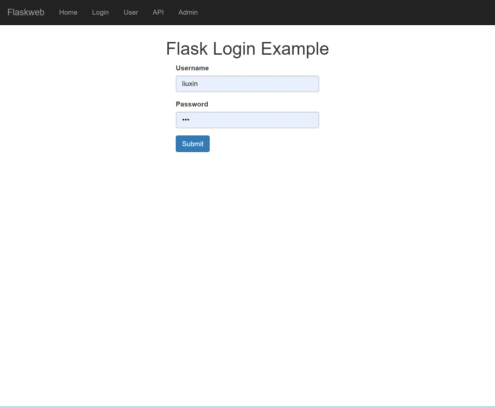
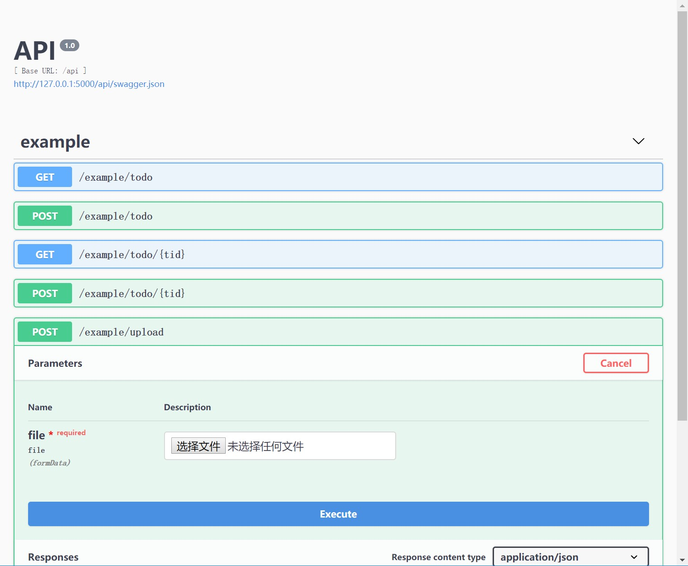
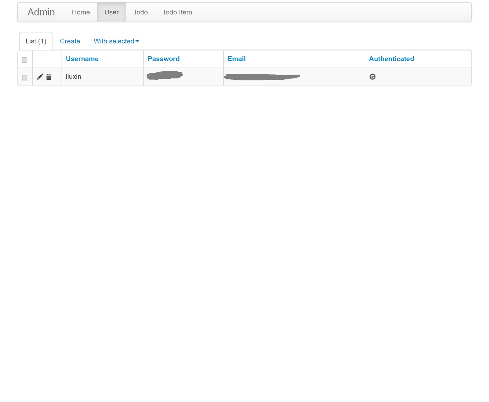

Flaskweb
========
An easy to start yet [full-featured](#features) web framework

* [Installation](#installation)
* [Quickstart](#quickstart)
* [Features](#features)
    * [more todos](#more-todos)
* [Tutorial](#tutorial)
    * [10分钟速成版](#10分钟速成版)
    * [Serious python web developer version <g-emoji class="g-emoji" alias="alien" fallback-src="https://github.githubassets.com/images/icons/emoji/unicode/1f47d.png">👽</g-emoji>](#serious-python-web-developer-version-alien)
* [Thanks](#thanks)

# Installation
```bash
pip install -U flaskweb

# or git clone and install; git pull for later updates
git clone git@github.com:Meteorix/flaskweb.git
pip install -e flaskweb
```

# Quickstart
基本语法与flask几乎一样，几行代码即可构建一个web服务器
```python
from flaskweb.app import create_app, gevent_run
from flask import render_template

app = create_app("debug")

@app.route("/")
def index():
    return render_template("main.html")

if __name__ == "__main__":
    gevent_run(app)
```
不一样的地方在于，上面的web服务器自带：
*   用户登录系统
*   orm/migrate
*   db管理页面
*   restapi/swaggerui
*   gevent服务器

|||
|-------|---------|
|||
| ||


try it:
```bash
cd simple
# 初始化数据库，会保存到simple/app.db
flask db init
flask db upgrade
flask db migrate
# 运行gevent服务器
python -u app.py
```
then visit http://127.0.0.1:5000/

A more [sophisticated example](./example)


# Features
*   flask
*   sqlalchemy
*   config
*   logger
*   user login
*   db admin
*   restful api with swagger ui
*   gunicorn/gevent deployment
*   use as a 3rd library
*   frontend with bootstrap/jquery

## more todos
*   deployment: nginx/gunicorn
*   more samples: tensorflow/pytorch webapp
*   jwt
*   cythonize
*   pyinstaller
*   dockerfile
*   performance/benchmark

# Tutorial

## 10分钟速成版

假设你有python和flask基础，介绍如何利用flaskweb速成

1. 创建新的项目

    将[example](./example)目录copy到你的项目中，作为启动模板

1. 定义url，返回默认html页面
    ```python
    @app.route("/")
    def index():
        return render_template("main.html")
    ```
    启动服务器，访问 http://127.0.0.1:5000/
    ```bash
    python wsgi.py
    ```

1. 创建sqlite数据库，使用内置的用户登录系统
    ```bash
    cd simple
    # 初始化数据库，会保存到simple/app.db
    flask db init
    flask db migrate
    flask db upgrade
    ```
    重启服务器，访问登陆页面 http://127.0.0.1:5000/login

1. 当然你需要先注册用户

    在注册页面上注册好之后，``debug``模式运行会自动激活账号，直接登录

    非``debug``模式需要找管理员激活账号：管理员访问admin页面 [http://127.0.0.1:5000/admin/user](http://127.0.0.1:5000/admin/user)，勾选用户的``active``属性

1. 定义数据库orm，使用admin页面管理

    参考 [example/models.py](./example/models.py)

1. 定义restful api，使用swagger ui调试

    参考 [example/views.py](./example/views.py)

    访问 http://127.0.0.1:5000/swagger/ 调试API，调试好就可以给前端工程师开发前端了

1. 前端工程师输出前端代码

    *   html文件放到```templates```目录
    *   其他文件放到```static```目录

1. 10分钟差不多都学会啦


## Serious python web developer version :alien:
1. python basics
1. [flask quickstart](http://docs.jinkan.org/docs/flask/quickstart.html)
1. [sql基础](http://www.runoob.com/mysql/mysql-tutorial.html)
1. [html/css/js基础](https://www.w3cschool.cn/html/)
1. [restful api规范](https://www.ruanyifeng.com/blog/2011/09/restful.html)
1. ...
1. http/tcp协议《http权威指南》
1. linux知识《APUE》
1. ...

# Development

```bash
python setup.py build
python setup.py sdist
# release to pypi
python -m twine upload dist/...
```

# Thanks
*   https://github.com/miguelgrinberg/flasky
*   https://github.com/JackStouffer/Flask-Foundation
